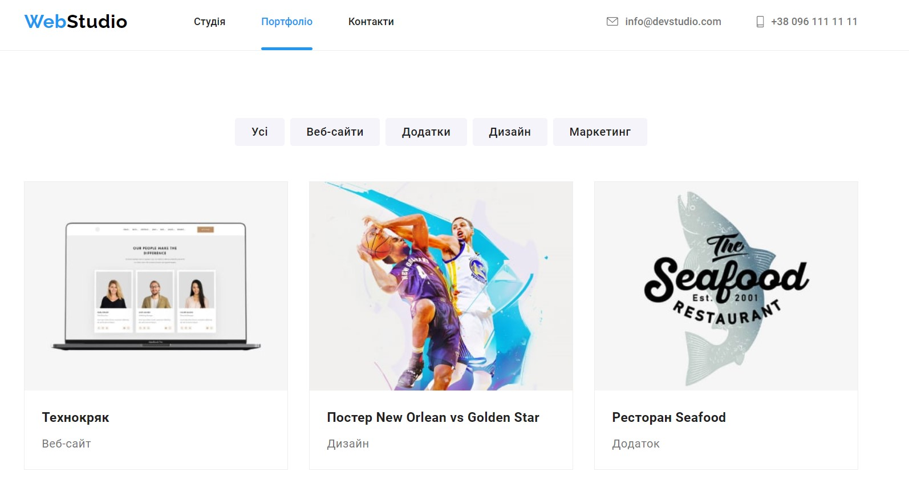

# Webstudio

This is a website developed for a web studio. Here you can order the company’s services and view the team’s portfolio of work.

This is a two-page

## Website with a responsive layout, adapted for computer

## laptop

## and mobile versions.

## Link to the app

**To use the application, please follow the link**
[Webstudio App](https://tetiana892.github.io/goit-markup-hw-08/index.html).

## Technologies and tools used in development:

## Contact

If you have any questions, suggestions, or need assistance, feel free to contact
our support team at tatina892@gmail.com.

<b>Thank you very much for choosing  application!</b>
  

